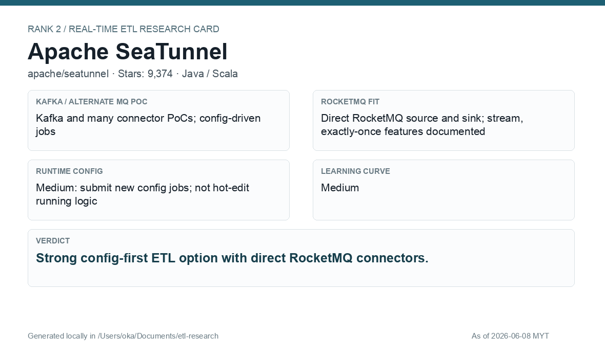

# Apache SeaTunnel

[Back to candidate index](README.md) | [Main report](realtime-etl-research.md)

## Recommendation

Apache SeaTunnel is the strongest config-first ETL candidate for direct RocketMQ source/sink work. It is easier to operate than raw Flink when the transformation is mostly movement, filtering, projection, and SQL-style enrichment.

## Fit Summary

| Area | Assessment |
|---|---|
| Rank | 2 |
| GitHub stars | 9,374 |
| Runtime config for new pipeline | Medium: config-driven job submission; not hot-edit running logic |
| Learning curve | Medium |
| Tech stack fit | Java/Scala; easier config path than raw Flink |
| MQ / RocketMQ fit | Direct RocketMQ source and sink; stream and exactly-once features documented |

## Phase 2 Proof

| Field | Result |
|---|---|
| Status | Complete |
| Queue | Kafka/Redpanda |
| Source -> Transform -> Sink | `phase2-seatunnel-wallet-events-v2` -> SQL JSON filter/enrich -> `phase2-seatunnel-wallet-filtered-v2` |
| Pod record | [pods](../local-setup/phase2-k8s-proofs/02-seatunnel-pods-running.txt) |
| Sink evidence | [sink](../local-setup/phase2-k8s-proofs/02-seatunnel-filtered.txt) |

## Screenshots

## Notes

Use SeaTunnel when the platform should stay config-first and the team wants direct RocketMQ integration without building every pipeline as application code.
