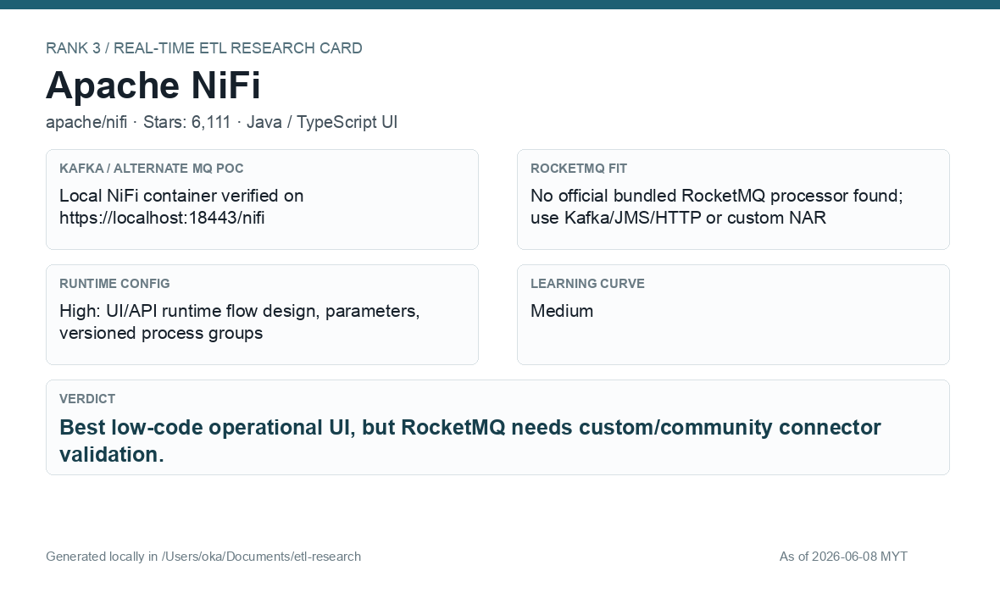

# Apache NiFi

[Back to candidate index](README.md) | [Main report](realtime-etl-research.md)

## Recommendation

Apache NiFi is the best low-code UI option in the list. It is strong for operational dataflows, parameterized flows, and REST/API driven flow creation, but RocketMQ integration needs connector validation or custom processor work.

## Fit Summary

| Area | Assessment |
|---|---|
| Rank | 3 |
| GitHub stars | 6,111 |
| Runtime config for new pipeline | High: UI/API design, parameters, and versioned process groups |
| Learning curve | Medium |
| Tech stack fit | Java backend with TypeScript UI |
| MQ / RocketMQ fit | Kafka/JMS/HTTP are strong; no official bundled RocketMQ processor found |

## Phase 2 Proof

| Field | Result |
|---|---|
| Status | Complete |
| Queue | Kafka/Redpanda |
| Source -> Transform -> Sink | `phase2-nifi-wallet-events-<run-id>` -> NiFi `ConsumeKafka` -> Groovy `ExecuteScript` JSON parse/filter/enrich -> NiFi `PublishKafka` -> `phase2-nifi-wallet-filtered-<run-id>` |
| Pod record | [pods](../local-setup/phase2-k8s-proofs/03-nifi-pods-running.txt) |
| Flow evidence | [flow](../local-setup/phase2-k8s-proofs/03-nifi-flow-status-summary.txt) |
| Source evidence | [source](../local-setup/phase2-k8s-proofs/03-nifi-source-topic.txt) |
| Sink evidence | [sink](../local-setup/phase2-k8s-proofs/03-nifi-sink-topic.txt) |

## Screenshots

## Notes

Use NiFi if runtime flow editing and UI governance are important. Do not lead with it for RocketMQ until the RocketMQ connector/custom NAR approach is proven.
