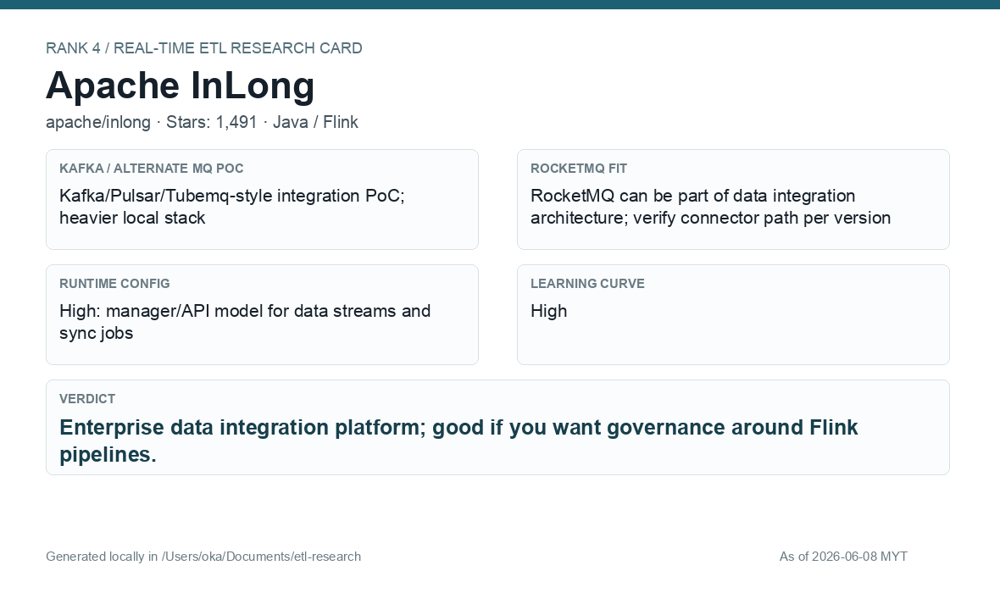
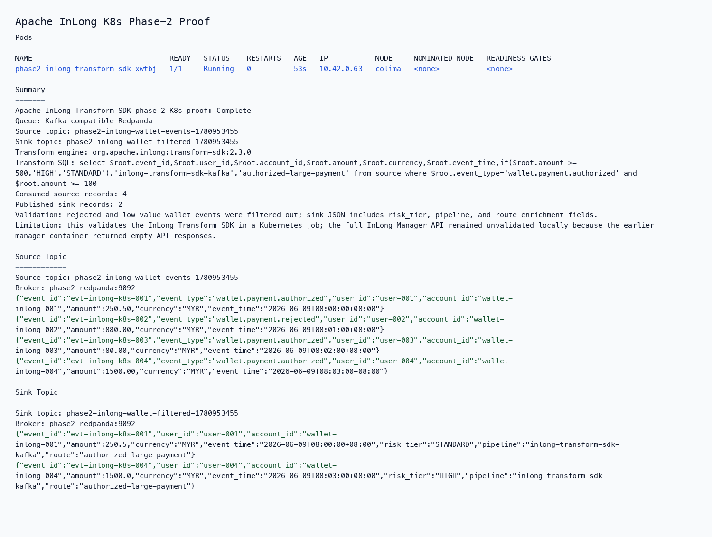

# Apache InLong

[Back to candidate index](README.md) | [Main report](realtime-etl-research.md)

## Recommendation

Apache InLong is a good governance-oriented platform candidate, and its Transform SDK worked in the phase-2 Java/Kafka proof. The full InLong Manager API still needs separate validation because the local Manager container returned empty API responses during the earlier compose run.

## Fit Summary

| Area | Assessment |
|---|---|
| Rank | 4 |
| GitHub stars | 1,491 |
| Runtime config for new pipeline | High: manager/API model for data streams and sync jobs |
| Learning curve | High |
| Tech stack fit | Java/Flink ecosystem |
| MQ / RocketMQ fit | Good real-time integration architecture; RocketMQ path should be version-validated |

## Phase 2 Proof

| Field | Result |
|---|---|
| Status | Complete |
| Queue | Kafka/Redpanda |
| Source -> Transform -> Sink | `phase2-inlong-wallet-events-<run-id>` -> Java pod using Apache InLong Transform SDK SQL over JSON filter/enrich -> `phase2-inlong-wallet-filtered-<run-id>` JSON sink topic |
| Pod record | [pods](../local-setup/phase2-k8s-proofs/04-inlong-pods-running.txt) |
| Summary | [summary](../local-setup/phase2-k8s-proofs/04-inlong-summary.txt) |
| Source evidence | [source](../local-setup/phase2-k8s-proofs/04-inlong-source-topic.txt) |
| Sink evidence | [sink](../local-setup/phase2-k8s-proofs/04-inlong-sink-topic.txt) |

## Screenshots

## Notes

Use InLong only after validating Manager/API health on the target laptop/server architecture. The Transform SDK result is useful, but it is not the same as proving the full control plane.
