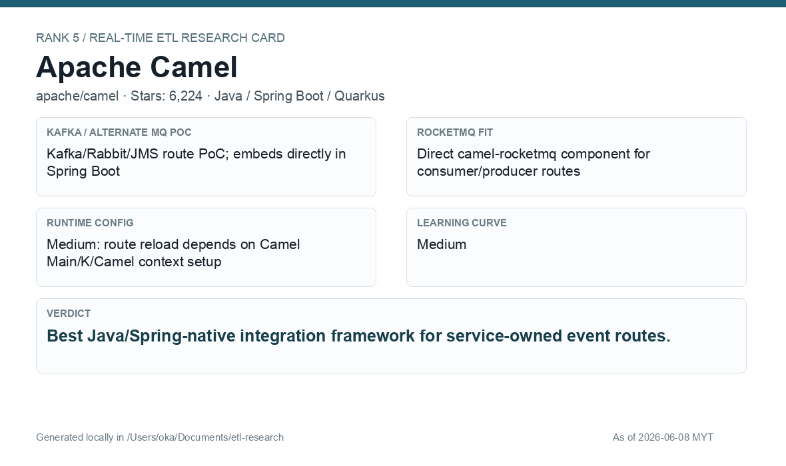
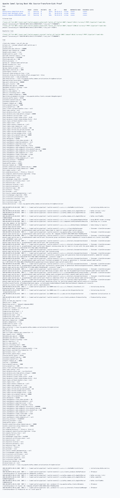
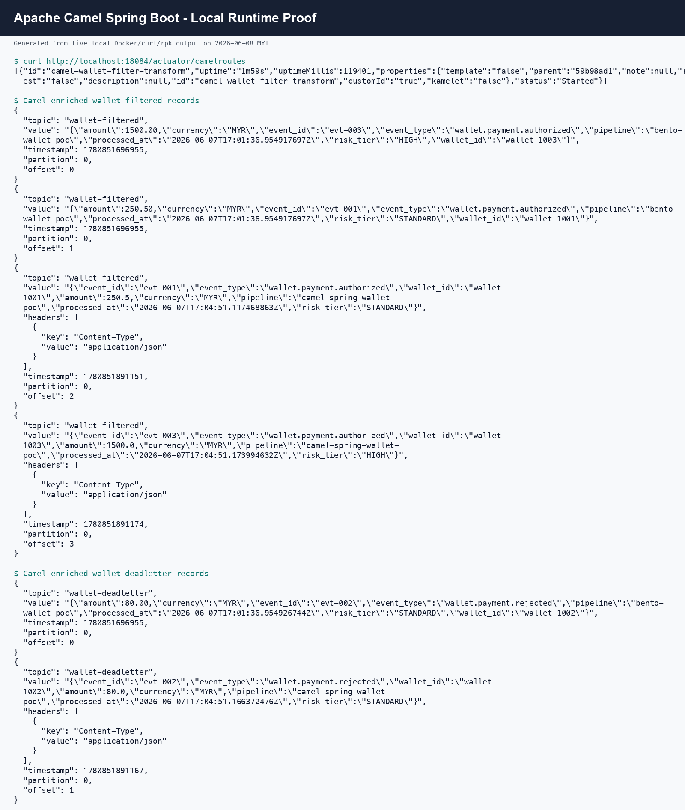

# Apache Camel

[Back to candidate index](README.md) | [Main report](realtime-etl-research.md)

## Recommendation

Apache Camel is the best Spring-native route framework for service-owned pipelines. It fits a Java/Spring Boot engineering team well and has direct RocketMQ component support.

## Fit Summary

| Area | Assessment |
|---|---|
| Rank | 5 |
| GitHub stars | 6,224 |
| Runtime config for new pipeline | Medium: route reload depends on runtime style |
| Learning curve | Medium |
| Tech stack fit | Excellent for Spring Boot teams |
| MQ / RocketMQ fit | Direct `camel-rocketmq`; Kafka/JMS/Rabbit also mature |

## Phase 2 Proof

| Field | Result |
|---|---|
| Status | Complete |
| Queue | Kafka/Redpanda |
| Source -> Transform -> Sink | `phase2-camel-wallet-events` -> Spring Boot route JSON parse/filter/enrich -> filtered/deadletter topics |
| Pod record | [pods](../local-setup/phase2-k8s-proofs/05-camel-pods-running.txt) |
| Filtered evidence | [filtered](../local-setup/phase2-k8s-proofs/05-camel-filtered.txt) |
| Deadletter evidence | [deadletter](../local-setup/phase2-k8s-proofs/05-camel-deadletter.txt) |

## Screenshots

## Notes

Use Camel when each pipeline is owned like a service and the company wants Java code review, Spring Boot deployment patterns, and straightforward RocketMQ integration.
