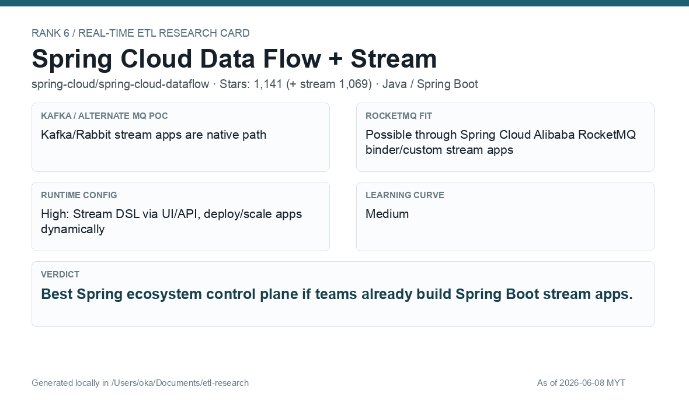

# Spring Cloud Data Flow + Spring Cloud Stream

[Back to candidate index](README.md) | [Main report](realtime-etl-research.md)

## Recommendation

Spring Cloud Data Flow is a strong fit if the organization wants Spring Boot app pipelines as managed products. It gives stream DSL and dashboard/API controls while keeping processor code in familiar Spring Cloud Stream apps.

## Fit Summary

| Area | Assessment |
|---|---|
| Rank | 6 |
| GitHub stars | 1,141; Stream 1,069 |
| Runtime config for new pipeline | High: Stream DSL via UI/API |
| Learning curve | Medium |
| Tech stack fit | Excellent Spring Boot fit |
| MQ / RocketMQ fit | Kafka/Rabbit native; RocketMQ via Spring Cloud Alibaba/custom binder |

## Phase 2 Proof

| Field | Result |
|---|---|
| Status | Complete |
| Queue | Kafka/Redpanda |
| Source -> Transform -> Sink | `phase2-scdf-wallet-events-<run-id>` -> SCDF Data Flow/Skipper runtime plus Spring Cloud Stream Kafka function JSON parse/filter/enrich -> `phase2-scdf-wallet-filtered-<run-id>` |
| Pod record | [pods](../local-setup/phase2-k8s-proofs/06-scdf-pods-running.txt) |
| Summary | [summary](../local-setup/phase2-k8s-proofs/06-scdf-summary.txt) |
| Source evidence | [source](../local-setup/phase2-k8s-proofs/06-scdf-source-topic.txt) |
| Sink evidence | [sink](../local-setup/phase2-k8s-proofs/06-scdf-sink-topic.txt) |

## Screenshots

## Notes

Use SCDF when the team values Spring Boot ownership and stream app lifecycle management more than a general-purpose stream engine.
