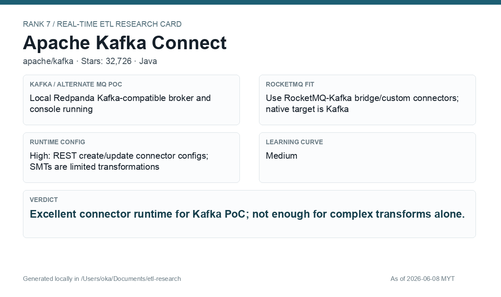

# Apache Kafka Connect

[Back to candidate index](README.md) | [Main report](realtime-etl-research.md)

## Recommendation

Apache Kafka Connect is an excellent connector runtime but should be paired with Flink, Camel, or another transform engine for richer e-wallet business logic. It is strongest for connector lifecycle and runtime config.

## Fit Summary

| Area | Assessment |
|---|---|
| Rank | 7 |
| GitHub stars | 32,726 |
| Runtime config for new pipeline | High: REST connector create/update; SMT transforms are limited |
| Learning curve | Medium |
| Tech stack fit | Java |
| MQ / RocketMQ fit | Great Kafka PoC; RocketMQ requires bridge/custom connectors |

## Phase 2 Proof

| Field | Result |
|---|---|
| Status | Complete |
| Queue | Kafka/Redpanda |
| Source -> Transform -> Sink | FileStreamSource `wallet-events.jsonl` -> `phase2-kafka-connect-wallet-raw-v2` -> custom Java SMT JSON parse/filter/enrich -> FileStreamSink `wallet-filtered-v2.jsonl` |
| Pod record | [pods](../local-setup/phase2-k8s-proofs/07-kafka-connect-pods-running.txt) |
| Connector status | [status](../local-setup/phase2-k8s-proofs/07-kafka-connect-connector-status.txt) |
| Sink evidence | [sink](../local-setup/phase2-k8s-proofs/07-kafka-connect-filtered.txt) |

## Screenshots

## Notes

Use Kafka Connect for ingestion and delivery connectors. Avoid relying on SMTs alone for complex wallet-event business logic.
