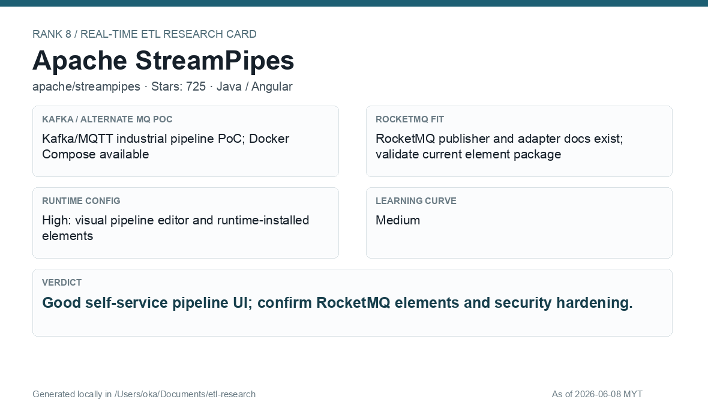
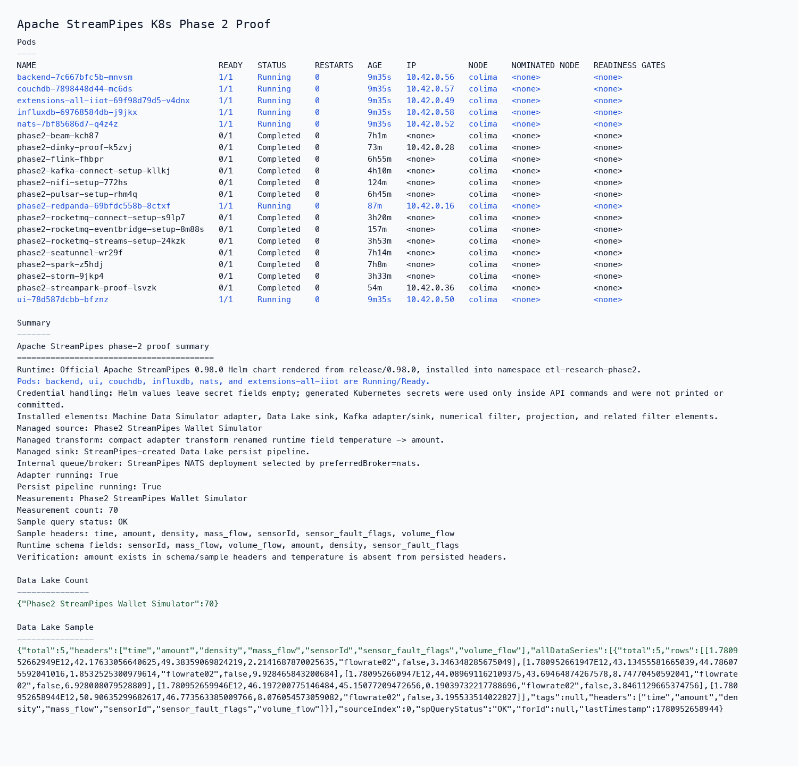
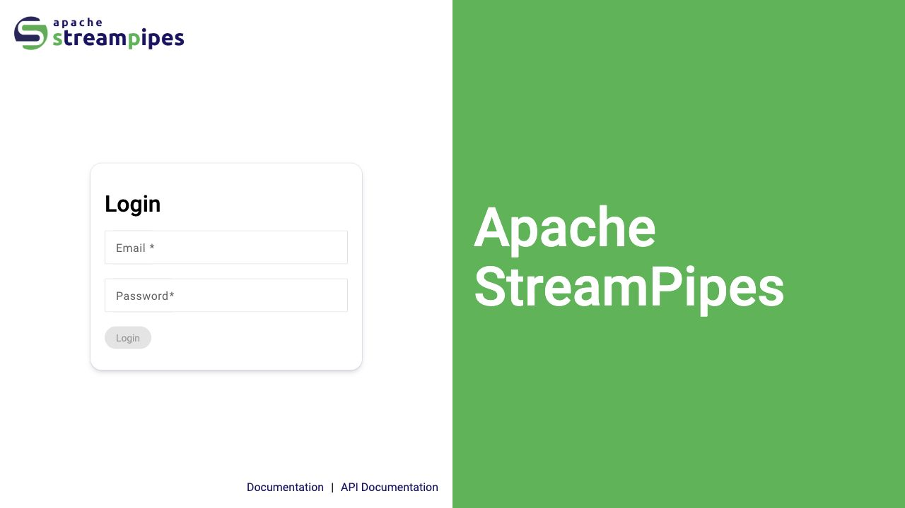

# Apache StreamPipes

[Back to candidate index](README.md) | [Main report](realtime-etl-research.md)

## Recommendation

Apache StreamPipes is an interesting self-service UI platform with strong visual pipeline editing. It is less proven as the main financial event backbone, but useful where teams need visual runtime configuration.

## Fit Summary

| Area | Assessment |
|---|---|
| Rank | 8 |
| GitHub stars | 725 |
| Runtime config for new pipeline | High: visual pipeline editor and runtime-installed elements |
| Learning curve | Medium |
| Tech stack fit | Java backend |
| MQ / RocketMQ fit | Kafka/MQTT strong; RocketMQ and TubeMQ/InLong extensions installed in local package |

## Phase 2 Proof

| Field | Result |
|---|---|
| Status | Complete |
| Queue | StreamPipes internal NATS |
| Source -> Transform -> Sink | Machine Data Simulator compact adapter -> compact adapter field rename `temperature` to `amount` -> StreamPipes-created Data Lake persist pipeline |
| Pod record | [pods](../local-setup/phase2-k8s-proofs/08-streampipes-pods-running.txt) |
| Summary | [summary](../local-setup/phase2-k8s-proofs/08-streampipes-summary.txt) |
| Count evidence | [count](../local-setup/phase2-k8s-proofs/08-streampipes-datalake-count.json) |
| Sample evidence | [sample](../local-setup/phase2-k8s-proofs/08-streampipes-datalake-sample.json) |

## Screenshots

## Notes

Use StreamPipes for self-service pipeline exploration. Validate Kafka/RocketMQ adapter behavior against production event volume before using it for core wallet processing.
