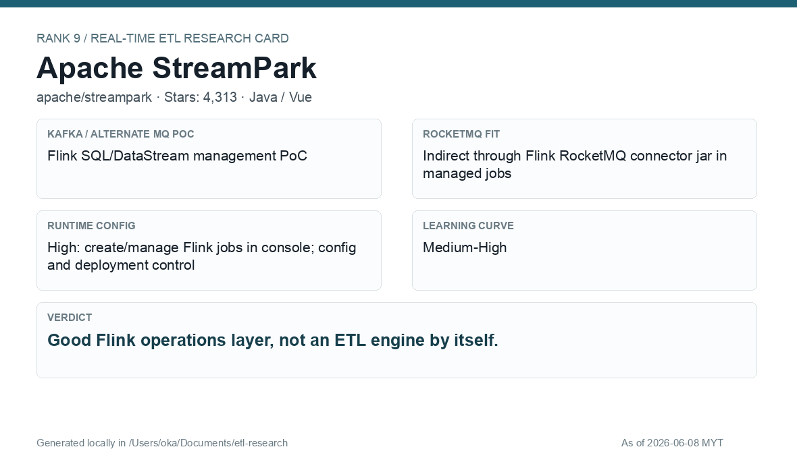

# Apache StreamPark

[Back to candidate index](README.md) | [Main report](realtime-etl-research.md)

## Recommendation

Apache StreamPark is a good operations layer if Flink is selected. It improves job submission and management but should be evaluated as a Flink console, not as the core transform engine itself.

## Fit Summary

| Area | Assessment |
|---|---|
| Rank | 9 |
| GitHub stars | 4,313 |
| Runtime config for new pipeline | High: create/manage Flink jobs from console |
| Learning curve | Medium-High |
| Tech stack fit | Java/Vue; Flink ops layer |
| MQ / RocketMQ fit | Indirect through Flink RocketMQ connector JAR |

## Phase 2 Proof

| Field | Result |
|---|---|
| Status | Complete |
| Queue | Kafka/Redpanda |
| Source -> Transform -> Sink | `phase2-streampark-wallet-events-<run-id>` -> StreamPark console runtime plus Flink SQL Kafka source table JSON parse/filter/enrich -> `phase2-streampark-wallet-filtered-<run-id>` |
| Pod record | [pods](../local-setup/phase2-k8s-proofs/09-streampark-pods-running.txt) |
| Summary | [summary](../local-setup/phase2-k8s-proofs/09-streampark-summary.txt) |
| Source evidence | [source](../local-setup/phase2-k8s-proofs/09-streampark-source-topic.txt) |
| Sink evidence | [sink](../local-setup/phase2-k8s-proofs/09-streampark-sink-topic.txt) |

## Screenshots

## Notes

Use StreamPark if Flink becomes the selected engine and the team wants a dedicated console for Flink application management.
