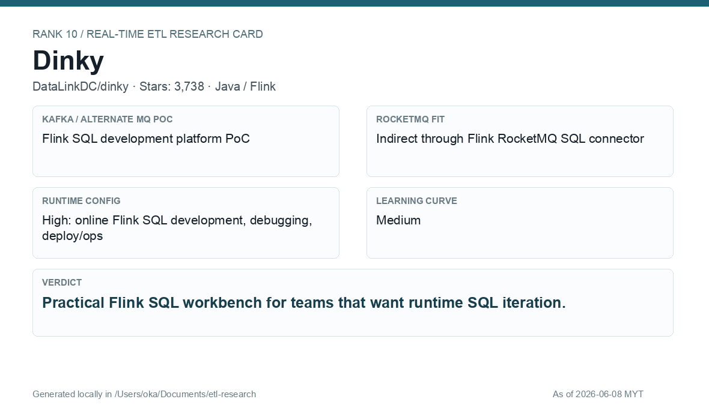
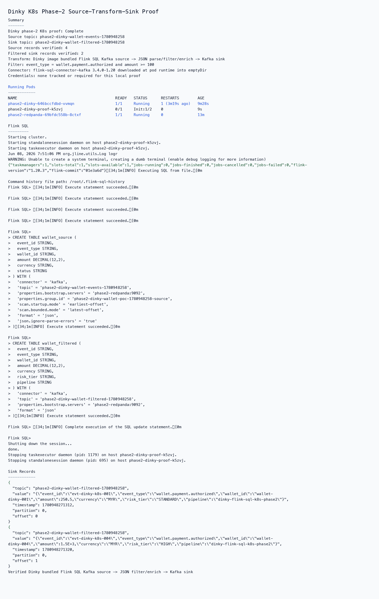
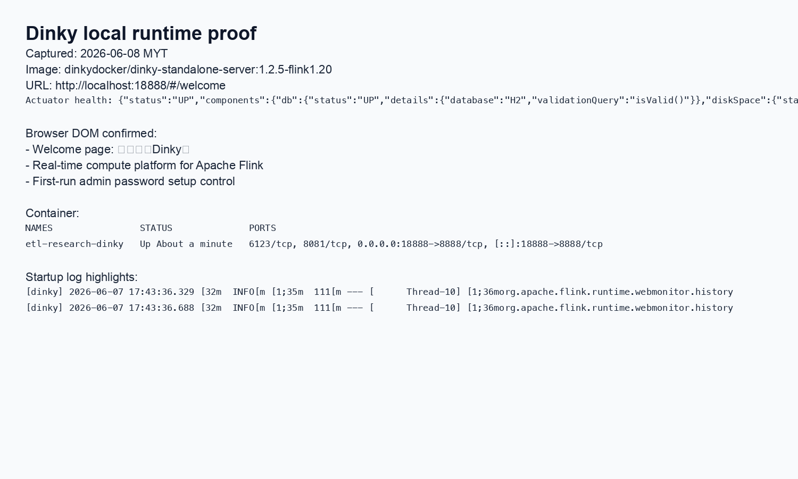

# Dinky

[Back to candidate index](README.md) | [Main report](realtime-etl-research.md)

## Recommendation

Dinky is a practical Flink SQL workbench for runtime SQL development and iteration. It is useful if the company chooses Flink and wants SQL authoring/debugging capabilities around it.

## Fit Summary

| Area | Assessment |
|---|---|
| Rank | 10 |
| GitHub stars | 3,738 |
| Runtime config for new pipeline | High: online Flink SQL dev/debug/deploy |
| Learning curve | Medium |
| Tech stack fit | Java/Flink |
| MQ / RocketMQ fit | Indirect through Flink RocketMQ SQL connector |

## Phase 2 Proof

| Field | Result |
|---|---|
| Status | Complete |
| Queue | Kafka/Redpanda |
| Source -> Transform -> Sink | `phase2-dinky-wallet-events-<run-id>` -> Dinky image bundled Flink SQL Kafka source table JSON parse/filter/enrich -> `phase2-dinky-wallet-filtered-<run-id>` |
| Pod record | [pods](../local-setup/phase2-k8s-proofs/10-dinky-pods-running.txt) |
| Summary | [summary](../local-setup/phase2-k8s-proofs/10-dinky-summary.txt) |
| Source evidence | [source](../local-setup/phase2-k8s-proofs/10-dinky-source-topic.txt) |
| Sink evidence | [sink](../local-setup/phase2-k8s-proofs/10-dinky-sink-topic.txt) |

## Screenshots

## Notes

Use Dinky as a companion to Flink SQL, not as a broker or independent stream-processing engine replacement.
