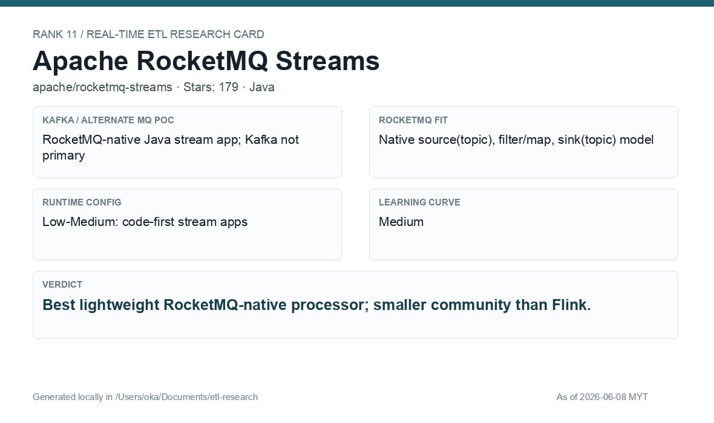

# Apache RocketMQ Streams

[Back to candidate index](README.md) | [Main report](realtime-etl-research.md)

## Recommendation

Apache RocketMQ Streams is a good lightweight RocketMQ-native processor. Its main risk is smaller community momentum compared with Flink, but it is worth a focused PoC if native RocketMQ processing is preferred.

## Fit Summary

| Area | Assessment |
|---|---|
| Rank | 11 |
| GitHub stars | 179 |
| Runtime config for new pipeline | Low-Medium: code-first stream apps |
| Learning curve | Medium |
| Tech stack fit | Java |
| MQ / RocketMQ fit | Native RocketMQ source/filter/map/sink model |

## Phase 2 Proof

| Field | Result |
|---|---|
| Status | Complete |
| Queue | RocketMQ |
| Source -> Transform -> Sink | `phase2-rocketmq-streams-wallet-events-v5` -> Java RocketMQ Streams JSON parse/filter/enrich -> `phase2-rocketmq-streams-wallet-filtered-v5` |
| Pod record | [pods](../local-setup/phase2-k8s-proofs/11-rocketmq-streams-pods-running.txt) |
| Source evidence | [source](../local-setup/phase2-k8s-proofs/11-rocketmq-streams-source.txt) |
| Sink evidence | [sink](../local-setup/phase2-k8s-proofs/11-rocketmq-streams-sink.txt) |

## Screenshots

## Notes

Use RocketMQ Streams if the final architecture is RocketMQ-native and the team accepts code-first Java stream applications.
