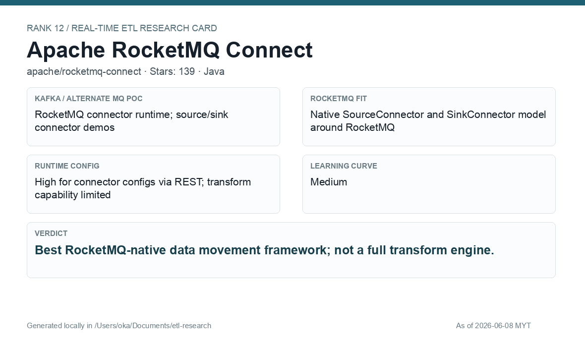

# Apache RocketMQ Connect

[Back to candidate index](README.md) | [Main report](realtime-etl-research.md)

## Recommendation

Apache RocketMQ Connect is the best RocketMQ-native data movement runtime, but it is not a full transform engine. Use it for connector-style movement and pair it with another processor for richer business rules.

## Fit Summary

| Area | Assessment |
|---|---|
| Rank | 12 |
| GitHub stars | 139 |
| Runtime config for new pipeline | High for connector configs via REST |
| Learning curve | Medium |
| Tech stack fit | Java |
| MQ / RocketMQ fit | Native RocketMQ SourceConnector/SinkConnector runtime |

## Phase 2 Proof

| Field | Result |
|---|---|
| Status | Complete |
| Queue | RocketMQ |
| Source -> Transform -> Sink | FileSourceConnector `/data/source/wallet-events.jsonl` -> `phase2-rocketmq-connect-wallet-raw-v1` -> sink-side JSON filter/enrich transform -> FileSinkConnector `/data/sink/wallet-filtered.jsonl` |
| Pod record | [pods](../local-setup/phase2-k8s-proofs/12-rocketmq-connect-pods-running.txt) |
| Status evidence | [status](../local-setup/phase2-k8s-proofs/12-rocketmq-connect-status.json) |
| Sink evidence | [sink](../local-setup/phase2-k8s-proofs/12-rocketmq-connect-sink.txt) |

## Screenshots

## Notes

Use RocketMQ Connect for source/sink connector deployment. Do not treat it as the main transformation platform for complex wallet-event rules.
