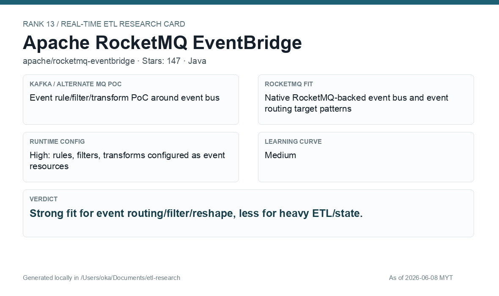

# Apache RocketMQ EventBridge

[Back to candidate index](README.md) | [Main report](realtime-etl-research.md)

## Recommendation

Apache RocketMQ EventBridge is strong for event routing, rule filtering, and reshape patterns. It is less suited to heavy ETL/stateful processing but valuable for rule-based event distribution.

## Fit Summary

| Area | Assessment |
|---|---|
| Rank | 13 |
| GitHub stars | 147 |
| Runtime config for new pipeline | High: runtime rules, filters, transforms |
| Learning curve | Medium |
| Tech stack fit | Java |
| MQ / RocketMQ fit | Native RocketMQ-backed event bus/routing patterns |

## Phase 2 Proof

| Field | Result |
|---|---|
| Status | Complete |
| Queue | RocketMQ |
| Source -> Transform -> Sink | EventBridge `/putEvents` CloudEvents -> RocketMQ-backed EventBridge bus topic -> rule filter on CloudEvent type + JSONPATH `$.data` transform -> file target `/data/sink/wallet-eventbridge-filtered.jsonl` |
| Pod record | [pods](../local-setup/phase2-k8s-proofs/13-rocketmq-eventbridge-pods-running.txt) |
| Event bus evidence | [source topic](../local-setup/phase2-k8s-proofs/13-rocketmq-eventbridge-eventbus-bodies.txt) |
| Sink evidence | [sink](../local-setup/phase2-k8s-proofs/13-rocketmq-eventbridge-sink.txt) |

## Screenshots

## Notes

Use RocketMQ EventBridge where the requirement is event routing and simple transform/filter, not full stateful ETL.
