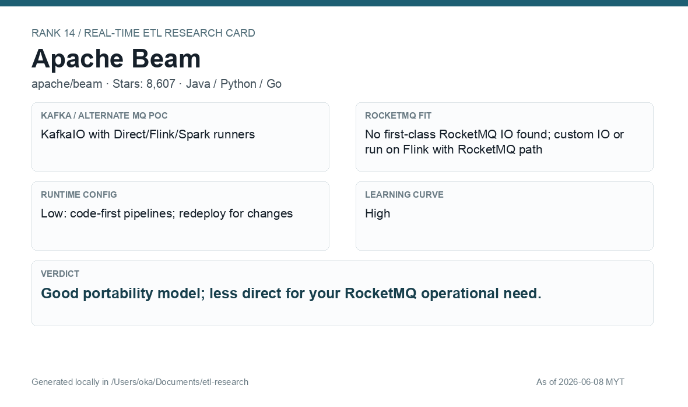

# Apache Beam

[Back to candidate index](README.md) | [Main report](realtime-etl-research.md)

## Recommendation

Apache Beam is useful if portability across runners matters. For this e-wallet/RocketMQ requirement, it has less direct operational value than Flink, SeaTunnel, or Camel.

## Fit Summary

| Area | Assessment |
|---|---|
| Rank | 14 |
| GitHub stars | 8,607 |
| Runtime config for new pipeline | Low: code-first, redeploy for changes |
| Learning curve | High |
| Tech stack fit | Java/Python/Go |
| MQ / RocketMQ fit | KafkaIO PoC; no first-class RocketMQ IO found |

## Phase 2 Proof

| Field | Result |
|---|---|
| Status | Complete |
| Queue | Kafka/Redpanda |
| Source -> Transform -> Sink | `phase2-beam-wallet-events-v3` -> Beam Kafka source + Python JSON filter/enrich -> `phase2-beam-wallet-filtered-v3` |
| Pod record | [pods](../local-setup/phase2-k8s-proofs/14-beam-pods-running.txt) |
| Sink evidence | [sink](../local-setup/phase2-k8s-proofs/14-beam-filtered.txt) |

## Screenshots

## Notes

Use Beam only if runner portability is a first-class requirement. Otherwise Flink is simpler to justify for this use case.
