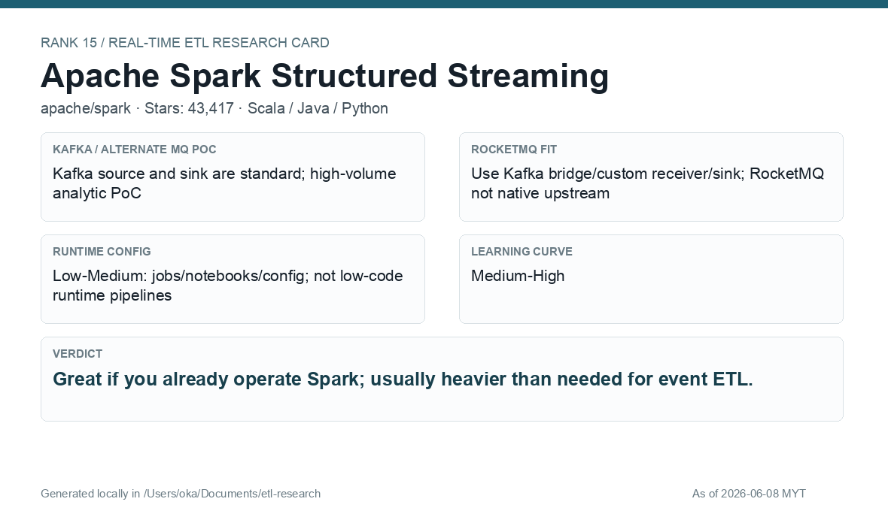

# Apache Spark Structured Streaming

[Back to candidate index](README.md) | [Main report](realtime-etl-research.md)

## Recommendation

Apache Spark Structured Streaming is a good analytics engine, but it is usually heavier than necessary for event ETL alone. It is strongest when the team already operates Spark for analytics workloads.

## Fit Summary

| Area | Assessment |
|---|---|
| Rank | 15 |
| GitHub stars | 43,417 |
| Runtime config for new pipeline | Low-Medium: jobs/notebooks/config, not low-code pipelines |
| Learning curve | Medium-High |
| Tech stack fit | Scala/Java/Python |
| MQ / RocketMQ fit | Kafka source/sink standard; RocketMQ needs bridge/custom sink |

## Phase 2 Proof

| Field | Result |
|---|---|
| Status | Complete |
| Queue | Kafka/Redpanda |
| Source -> Transform -> Sink | `phase2-spark-wallet-events-v2` -> Spark JSON filter/enrich -> `phase2-spark-wallet-filtered-v2` |
| Pod record | [pods](../local-setup/phase2-k8s-proofs/15-spark-pods-running.txt) |
| Sink evidence | [sink](../local-setup/phase2-k8s-proofs/15-spark-filtered.txt) |

## Screenshots

## Notes

Use Spark if wallet ETL is tied to analytics workloads. For low-latency operational event routing, Flink or Camel is a cleaner first choice.
