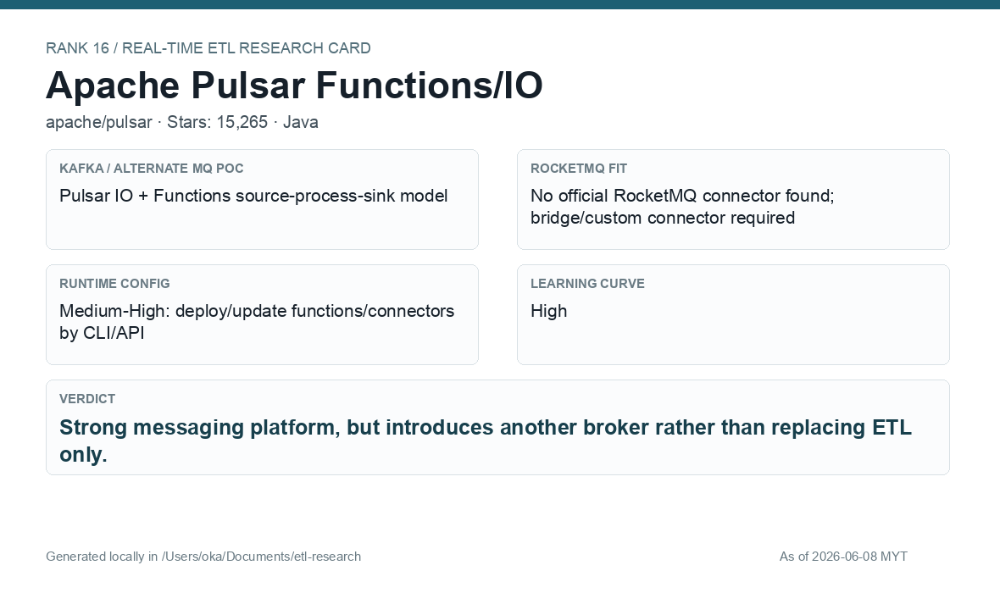

# Apache Pulsar Functions/IO

[Back to candidate index](README.md) | [Main report](realtime-etl-research.md)

## Recommendation

Apache Pulsar Functions/IO is a strong platform if Pulsar is the broker. For this requirement, it changes the broker architecture rather than only replacing the ETL layer.

## Fit Summary

| Area | Assessment |
|---|---|
| Rank | 16 |
| GitHub stars | 15,265 |
| Runtime config for new pipeline | Medium-High: CLI/API deploy/update functions/connectors |
| Learning curve | High |
| Tech stack fit | Java |
| MQ / RocketMQ fit | Strong if Pulsar is broker; RocketMQ requires bridge/custom connector |

## Phase 2 Proof

| Field | Result |
|---|---|
| Status | Complete |
| Queue | Pulsar |
| Source -> Transform -> Sink | `phase2-pulsar-wallet-events-v3` -> Pulsar Python Function JSON parse/filter/enrich -> `phase2-pulsar-wallet-filtered-v3` |
| Pod record | [pods](../local-setup/phase2-k8s-proofs/16-pulsar-pods-running.txt) |
| Function status | [status](../local-setup/phase2-k8s-proofs/16-pulsar-function-status.txt) |
| Sink evidence | [sink](../local-setup/phase2-k8s-proofs/16-pulsar-filtered.txt) |

## Screenshots

## Notes

Use Pulsar Functions/IO only if the company is willing to consider Pulsar as part of the messaging architecture.
