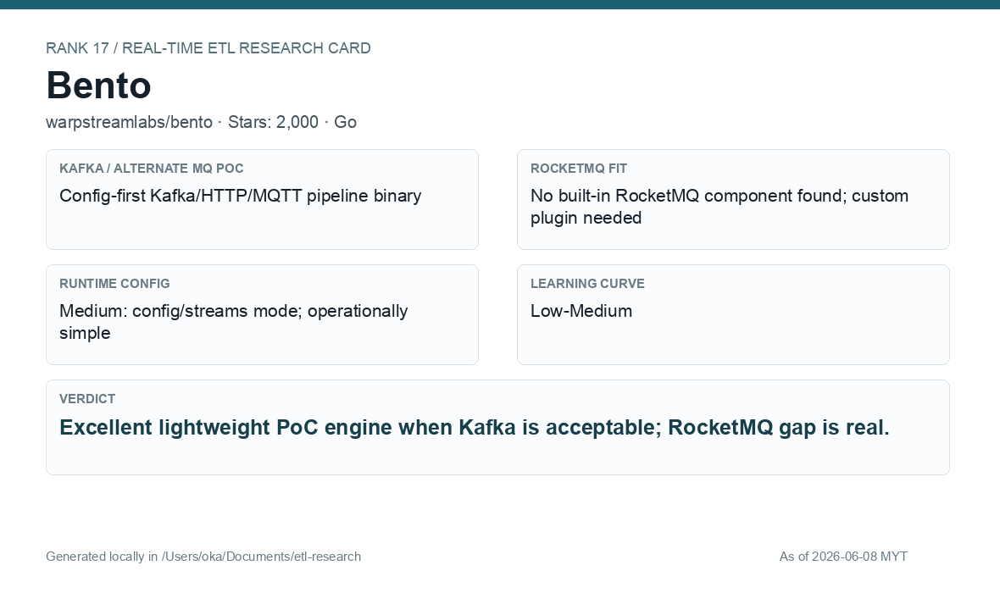

# Bento

[Back to candidate index](README.md) | [Main report](realtime-etl-research.md)

## Recommendation

Bento is an excellent lightweight Kafka-compatible PoC engine with simple config and Bloblang transforms. Its main gap for this company is no built-in RocketMQ support found in the research pass.

## Fit Summary

| Area | Assessment |
|---|---|
| Rank | 17 |
| GitHub stars | 2,000 |
| Runtime config for new pipeline | Medium: config/streams mode |
| Learning curve | Low-Medium |
| Tech stack fit | Go |
| MQ / RocketMQ fit | Kafka/HTTP/MQTT PoC; no built-in RocketMQ found |

## Phase 2 Proof

| Field | Result |
|---|---|
| Status | Complete |
| Queue | Kafka/Redpanda |
| Source -> Transform -> Sink | `phase2-bento-wallet-events` -> Bloblang JSON filter/enrich -> filtered/deadletter topics |
| Pod record | [pods](../local-setup/phase2-k8s-proofs/17-bento-pods-running.txt) |
| Filtered evidence | [filtered](../local-setup/phase2-k8s-proofs/17-bento-filtered.txt) |
| Deadletter evidence | [deadletter](../local-setup/phase2-k8s-proofs/17-bento-deadletter.txt) |

## Screenshots

## Notes

Use Bento for fast Kafka-compatible validation and lightweight stream transforms. Do not choose it as the final RocketMQ solution without a connector/bridge decision.
