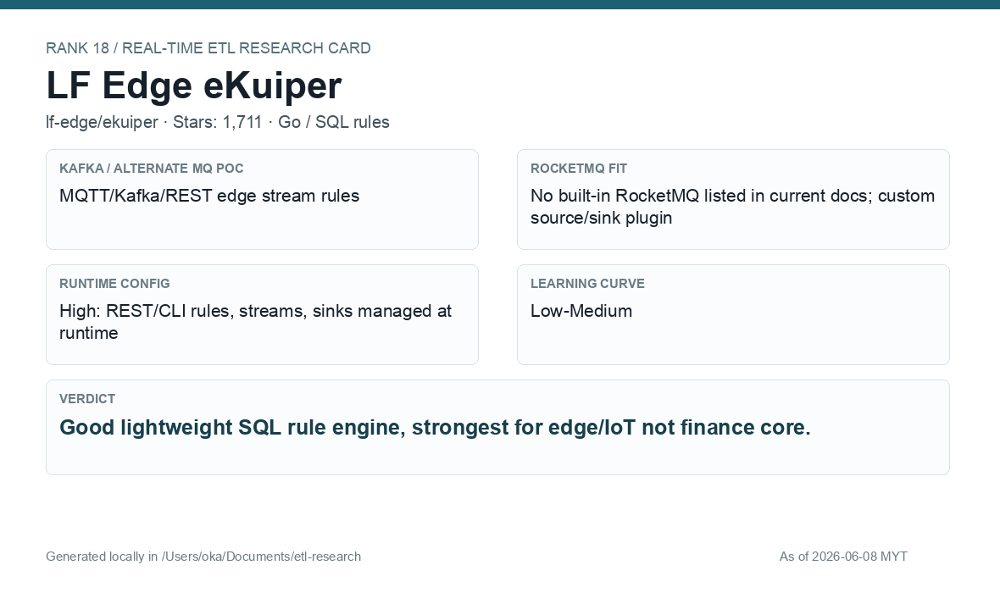

# LF Edge eKuiper

[Back to candidate index](README.md) | [Main report](realtime-etl-research.md)

## Recommendation

LF Edge eKuiper is a good lightweight SQL rule engine, strongest in edge/IoT style workloads. For e-wallet core processing, it is more suitable for simple routing/filtering than for a central stateful ETL backbone.

## Fit Summary

| Area | Assessment |
|---|---|
| Rank | 18 |
| GitHub stars | 1,711 |
| Runtime config for new pipeline | High: REST/CLI SQL rules at runtime |
| Learning curve | Low-Medium |
| Tech stack fit | Go/SQL |
| MQ / RocketMQ fit | MQTT/Kafka/REST strong; RocketMQ custom source/sink plugin |

## Phase 2 Proof

| Field | Result |
|---|---|
| Status | Complete |
| Queue | MQTT/Mosquitto |
| Source -> Transform -> Sink | `phase2/ekuiper/wallet-events` -> SQL JSON filter/enrich -> filtered/deadletter MQTT topics |
| Pod record | [pods](../local-setup/phase2-k8s-proofs/18-ekuiper-pods-running.txt) |
| Sink evidence | [sink](../local-setup/phase2-k8s-proofs/18-ekuiper-mqtt-output.txt) |

## Screenshots

## Notes

Use eKuiper for lightweight SQL rules and MQTT/Kafka style event processing. Validate custom RocketMQ plugin maintenance before considering it for production wallet events.
