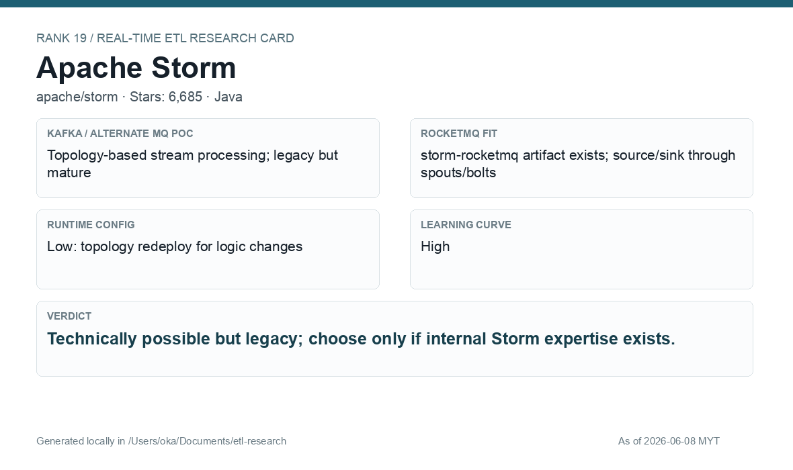

# Apache Storm

[Back to candidate index](README.md) | [Main report](realtime-etl-research.md)

## Recommendation

Apache Storm is technically possible but legacy. It should not be the lead choice unless the company already has Storm expertise and operational tooling.

## Fit Summary

| Area | Assessment |
|---|---|
| Rank | 19 |
| GitHub stars | 6,685 |
| Runtime config for new pipeline | Low: topology redeploy for changes |
| Learning curve | High |
| Tech stack fit | Java |
| MQ / RocketMQ fit | `storm-rocketmq` artifact exists; legacy spout/bolt model |

## Phase 2 Proof

| Field | Result |
|---|---|
| Status | Complete |
| Queue | Kafka/Redpanda |
| Source -> Transform -> Sink | `phase2-storm-wallet-events` -> Storm KafkaSpout + JSON filter/enrich bolt -> KafkaBolt sink `phase2-storm-wallet-filtered` |
| Pod record | [pods](../local-setup/phase2-k8s-proofs/19-storm-pods-running.txt) |
| Source evidence | [source](../local-setup/phase2-k8s-proofs/19-storm-source.txt) |
| Sink evidence | [sink](../local-setup/phase2-k8s-proofs/19-storm-sink.txt) |

## Screenshots

## Notes

Prefer Flink over Storm for new work. Storm remains valid only when existing operational knowledge outweighs modernization cost.
