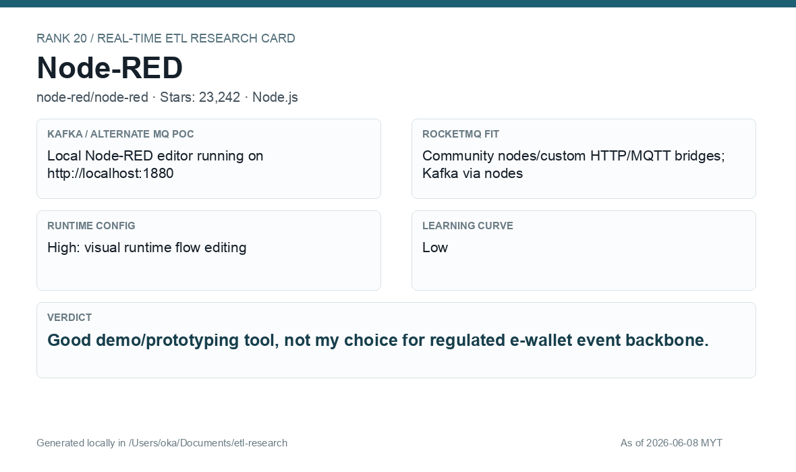

# Node-RED

[Back to candidate index](README.md) | [Main report](realtime-etl-research.md)

## Recommendation

Node-RED is useful for demos, prototypes, and internal tooling, but it is not a good lead choice for regulated e-wallet backbone processing.

## Fit Summary

| Area | Assessment |
|---|---|
| Rank | 20 |
| GitHub stars | 23,242 |
| Runtime config for new pipeline | High: visual runtime flow editing |
| Learning curve | Low |
| Tech stack fit | Node.js, not Java |
| MQ / RocketMQ fit | Kafka/community nodes; RocketMQ via custom/community bridge |

## Phase 2 Proof

| Field | Result |
|---|---|
| Status | Complete |
| Queue | MQTT/Mosquitto |
| Source -> Transform -> Sink | `phase2/nodered/wallet-events` -> flow JSON parse/filter/enrich -> filtered/deadletter MQTT topics |
| Pod record | [pods](../local-setup/phase2-k8s-proofs/20-node-red-pods-running.txt) |
| Sink evidence | [sink](../local-setup/phase2-k8s-proofs/20-node-red-mqtt-output.txt) |

## Screenshots

## Notes

Use Node-RED for exploration, demos, or non-critical internal flows. Avoid using it as the core e-wallet ETL platform.
