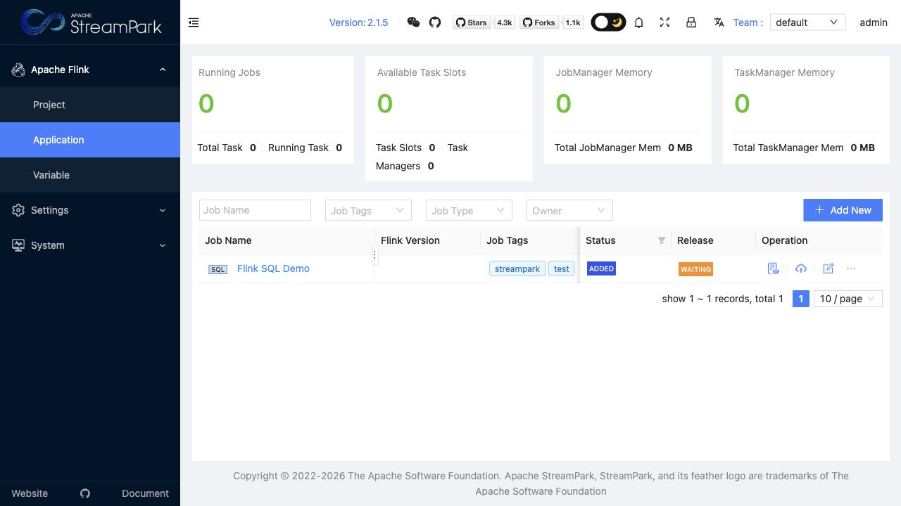

# Combination 1: Flink Java DataStream + StreamPark

[Back to combination index](README.md) | [Main research report](../realtime-etl-research.md)

## Recommendation

This is the strongest overall combination for your e-wallet ETL case.

Use **Apache Flink Java DataStream** as the actual stream-processing engine and **Apache StreamPark** as the operational console for managing packaged Flink jobs. This combination is the best fit when the pipeline needs custom Java code, async gRPC enrichment, state, replay, checkpointing, controlled deployment, and production observability.

The important distinction:

| Component | Role |
|---|---|
| Flink Java DataStream | Source/transform/sink execution engine |
| StreamPark | Flink job deployment and operations layer |
| Kafka/RocketMQ | Message queue source and sink |
| gRPC service | External enrichment dependency |

## Live UI Screenshot

This is a real logged-in StreamPark application page captured from `http://localhost:10000/#/flink/app` on 2026-06-22. The screenshot shows the `admin` session and an existing configured application row named `Flink SQL Demo` with tags `streampark` and `test`, status `ADDED`, and release state `WAITING`.



## Source / Transform / Sink Architecture

```text
Kafka or RocketMQ wallet event topic
        -> Flink Java DataStream job
        -> JSON parse
        -> business filter
        -> async gRPC enrichment
        -> risk_tier / metadata enrichment
        -> Kafka or RocketMQ filtered topic
        -> optional dead-letter topic
```

For your case, the transformation should be implemented in Java instead of SQL because a gRPC lookup is code-heavy and needs explicit timeout, retry, concurrency, idempotency, and failure behavior.

## Current Workspace Evidence

| Evidence | Status |
|---|---|
| Flink K8s source-transform-sink proof | Complete |
| Queue used in proof | Kafka-compatible Redpanda |
| Source topic | `phase2-flink-wallet-events-v3` |
| Sink topic | `phase2-flink-wallet-filtered-v3` |
| Transform | Java DataStream JSON parse/filter/enrich |
| StreamPark supporting proof | Complete as Flink operations layer |
| Proof files | [Flink sink](../../local-setup/phase2-k8s-proofs/01-flink-filtered.txt), [StreamPark summary](../../local-setup/phase2-k8s-proofs/09-streampark-summary.txt) |
| Local code | [WalletFlinkPipeline.java](../../local-setup/flink-wallet-pipeline/src/main/java/com/example/etl/flink/WalletFlinkPipeline.java) |

## Source Configuration

The current proof uses Kafka-compatible source configuration:

```java
KafkaSource<String> source = KafkaSource.<String>builder()
    .setBootstrapServers(brokers)
    .setTopics(sourceTopic)
    .setGroupId(groupId)
    .setStartingOffsets(OffsetsInitializer.earliest())
    .setValueOnlyDeserializer(new SimpleStringSchema())
    .build();
```

Runtime variables should come from environment or deployment config:

```properties
KAFKA_BROKERS=phase2-redpanda:9092
SOURCE_TOPIC=wallet-events
SINK_TOPIC=wallet-filtered
GROUP_ID=wallet-etl-flink-v1
```

For RocketMQ, use the `apache/rocketmq-flink` connector in a dedicated validation PoC. The connector README documents RocketMQ source and sink APIs, and notes source checkpoint behavior and sink at-least-once behavior when batch flush on checkpoint is enabled.

RocketMQ source shape:

```java
Properties consumerProps = new Properties();
consumerProps.setProperty(RocketMQConfig.NAME_SERVER_ADDR, "rocketmq-namesrv:9876");
consumerProps.setProperty(RocketMQConfig.CONSUMER_GROUP, "wallet-etl-flink");
consumerProps.setProperty(RocketMQConfig.CONSUMER_TOPIC, "wallet-events-rmq");

RocketMQSourceFunction<String> source =
    new RocketMQSourceFunction<>(new SimpleStringDeserializationSchema(), consumerProps);
source.setStartFromGroupOffsets(OffsetResetStrategy.EARLIEST);
```

## Transform Configuration

The current Java transform filters only authorized wallet payments with `amount >= 100`, then adds `pipeline` and `risk_tier`.

```java
env.fromSource(source, WatermarkStrategy.noWatermarks(), "wallet-kafka-source")
    .flatMap(new WalletFilterTransform())
    .sinkTo(sink);
```

For the gRPC version, put the external call after the filter:

```java
env.fromSource(source, WatermarkStrategy.noWatermarks(), "wallet-source")
    .flatMap(new WalletFilterTransform())
    .unorderedWait(new RiskGrpcAsyncFunction(), 800, TimeUnit.MILLISECONDS, 64)
    .sinkTo(sink);
```

Recommended gRPC behavior:

| Concern | Recommendation |
|---|---|
| Timeout | Hard timeout per request, for example 500-1000 ms |
| Concurrency | Limit async capacity to protect the gRPC service |
| Retry | Retry only idempotent reads; cap attempts |
| Failure | Route timeout/error to dead-letter or mark `risk_tier=UNKNOWN` based on business policy |
| Idempotency | Include `event_id` in request metadata |
| Backpressure | Let Flink backpressure when async capacity is full |

## Sink Configuration

Kafka-compatible sink from the current proof:

```java
KafkaSink<String> sink = KafkaSink.<String>builder()
    .setBootstrapServers(brokers)
    .setRecordSerializer(
        KafkaRecordSerializationSchema.builder()
            .setTopic(sinkTopic)
            .setValueSerializationSchema(new SimpleStringSchema())
            .build())
    .setDeliveryGuarantee(DeliveryGuarantee.AT_LEAST_ONCE)
    .build();
```

RocketMQ sink shape:

```java
Properties producerProps = new Properties();
producerProps.setProperty(RocketMQConfig.NAME_SERVER_ADDR, "rocketmq-namesrv:9876");

RocketMQSink<Message> sink = new RocketMQSink<>(producerProps)
    .withBatchFlushOnCheckpoint(true);
```

## StreamPark Operations Model

StreamPark should manage:

| Operation | StreamPark Responsibility |
|---|---|
| Application registry | Register the Flink Java application |
| Job packaging | Build/upload JAR through the selected CI/CD path |
| Environment variables | Store per-environment source/sink/topic settings |
| Deployment | Submit/restart Flink jobs |
| Savepoint/checkpoint workflow | Controlled upgrade and rollback path |
| Monitoring handoff | Link to Flink dashboard and metrics |

StreamPark should not own business logic. The business logic stays in the Flink Java project and is versioned in Git.

## UI Configuration Capability

| Question | Answer |
|---|---|
| Does this combination have a UI? | Yes, StreamPark |
| Can users configure/create jobs in UI? | Yes for Flink application registration, deployment parameters, environment settings, savepoint/restart workflow, and operational metadata |
| Can users write Java transform/gRPC logic in UI? | No |
| Best configuration model | Java business logic in Git + StreamPark for deployment/runtime operations |

StreamPark is useful when the team wants a UI to operate Flink jobs. It is not a browser-based ETL logic editor for Java DataStream code.

## Why This Beats SeaTunnel For gRPC

SeaTunnel is cleaner for config-first ETL, but gRPC enrichment is not just a config concern. The pipeline needs code-level control over request lifecycle, concurrency, errors, retries, and backpressure. Flink's async I/O model is designed for this class of external enrichment.

## Testing Plan

| Test | Required Evidence |
|---|---|
| Unit test | Java transform emits only authorized payments with `amount >= 100` |
| gRPC timeout test | Timed-out lookup routes to configured fallback/dead-letter behavior |
| Duplicate replay test | Replayed event does not create invalid external side effects |
| Checkpoint restart test | Kill/restart job and verify offsets recover correctly |
| Connector test | Run both Kafka and RocketMQ source/sink variants |
| Load test | Measure async gRPC capacity, backpressure, p95/p99 latency |

## Main Risks

- Higher learning curve than SeaTunnel or Camel.
- Connector version compatibility must be tested, especially RocketMQ.
- gRPC service can become the bottleneck if async capacity and timeout are not tuned.
- Exactly-once claims must be scoped carefully when external services are involved.

## Final Verdict

Choose this combination as the **default production path** if the wallet ETL platform is expected to grow into stateful processing, replay, fraud/risk enrichment, and Java-owned production-grade stream applications.

References:

- Flink async I/O: https://nightlies.apache.org/flink/flink-docs-stable/docs/dev/datastream/operators/asyncio/
- RocketMQ Flink connector: https://github.com/apache/rocketmq-flink
- StreamPark: https://streampark.apache.org/
