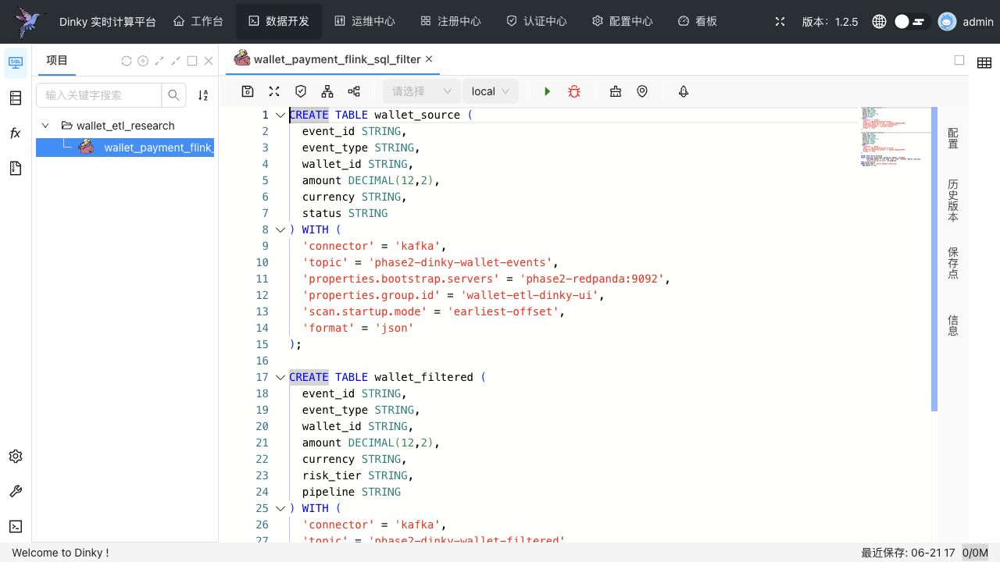

# Combination 2: Flink SQL + Dinky

[Back to combination index](README.md) | [Main research report](../realtime-etl-research.md)

## Recommendation

Use this combination when the team wants Flink as the engine but most ETL jobs can be expressed as SQL: source table, filter/projection/enrichment query, and sink table.

**Dinky is not the ETL engine.** Dinky is a Flink SQL development and operations workbench. Flink still performs the actual source/transform/sink execution.

| Component | Role |
|---|---|
| Flink SQL | Runtime execution of table source, SQL transform, and table sink |
| Dinky | SQL authoring, debugging, deployment, and monitoring layer |
| Kafka/RocketMQ | Source and sink message queues |

## Live UI Screenshot

This is a real logged-in Dinky Data Studio page captured from `http://localhost:18888/#/datastudio` on 2026-06-22. The screenshot shows the `admin` session, the configured catalog folder `wallet_etl_research`, and the opened Flink SQL task `wallet_payment_flink_sql_filter` containing Kafka/Redpanda source, transform, and sink SQL.



## Source / Transform / Sink Architecture

```text
Kafka or RocketMQ source table
        -> Flink SQL query
        -> filter wallet.payment.authorized
        -> require amount >= 100
        -> derive risk_tier
        -> add pipeline marker
        -> Kafka or RocketMQ sink table
```

This is a good path for rule-style transformations. It is less suitable than Flink Java DataStream for heavy custom Java code or gRPC calls.

## Current Workspace Evidence

| Evidence | Status |
|---|---|
| Dinky phase-2 proof | Complete |
| Queue used in proof | Kafka-compatible Redpanda |
| Source topic | `phase2-dinky-wallet-events-<run-id>` |
| Sink topic | `phase2-dinky-wallet-filtered-<run-id>` |
| Transform | Flink SQL JSON source table, SQL filter/enrichment, Kafka sink table |
| Proof files | [summary](../../local-setup/phase2-k8s-proofs/10-dinky-summary.txt), [sink](../../local-setup/phase2-k8s-proofs/10-dinky-sink-topic.txt) |
| Manifest | [dinky.yaml](../../local-setup/phase2-k8s/dinky.yaml) |

## Source Configuration

The current proof uses a Kafka table source:

```sql
CREATE TABLE wallet_source (
  event_id STRING,
  event_type STRING,
  wallet_id STRING,
  amount DECIMAL(12,2),
  currency STRING,
  status STRING
) WITH (
  'connector' = 'kafka',
  'topic' = '$SOURCE_TOPIC',
  'properties.bootstrap.servers' = '$BROKERS',
  'properties.group.id' = '$GROUP_ID-source',
  'scan.startup.mode' = 'earliest-offset',
  'scan.bounded.mode' = 'latest-offset',
  'format' = 'json',
  'json.ignore-parse-errors' = 'true'
);
```

RocketMQ SQL source shape from the RocketMQ Flink connector documentation:

```sql
CREATE TABLE wallet_source_rmq (
  event_id STRING,
  event_type STRING,
  wallet_id STRING,
  amount DECIMAL(12,2),
  currency STRING,
  status STRING
) WITH (
  'connector' = 'rocketmq',
  'topic' = 'wallet-events-rmq',
  'consumerGroup' = 'wallet-etl-dinky',
  'nameServerAddress' = 'rocketmq-namesrv:9876'
);
```

## Transform Configuration

The current proof query:

```sql
INSERT INTO wallet_filtered
SELECT
  event_id,
  event_type,
  wallet_id,
  amount,
  currency,
  CASE WHEN amount >= 1000 THEN 'HIGH' ELSE 'STANDARD' END AS risk_tier,
  'dinky-flink-sql-k8s-phase2' AS pipeline
FROM wallet_source
WHERE event_type = 'wallet.payment.authorized'
  AND amount >= 100;
```

For more advanced transformations, keep SQL for deterministic filters and projections, but move complex gRPC enrichment to Flink Java or Camel.

## Sink Configuration

Kafka table sink from the current proof:

```sql
CREATE TABLE wallet_filtered (
  event_id STRING,
  event_type STRING,
  wallet_id STRING,
  amount DECIMAL(12,2),
  currency STRING,
  risk_tier STRING,
  pipeline STRING
) WITH (
  'connector' = 'kafka',
  'topic' = '$SINK_TOPIC',
  'properties.bootstrap.servers' = '$BROKERS',
  'format' = 'json'
);
```

RocketMQ SQL sink shape:

```sql
CREATE TABLE wallet_filtered_rmq (
  event_id STRING,
  event_type STRING,
  wallet_id STRING,
  amount DECIMAL(12,2),
  currency STRING,
  risk_tier STRING,
  pipeline STRING
) WITH (
  'connector' = 'rocketmq',
  'topic' = 'wallet-filtered-rmq',
  'produceGroup' = 'wallet-etl-dinky-producer',
  'nameServerAddress' = 'rocketmq-namesrv:9876'
);
```

## Dinky Operations Model

| Operation | Dinky Fit |
|---|---|
| SQL authoring | Strong |
| SQL debugging | Strong |
| Job submission | Strong |
| Runtime edits | Better than Java JAR redeploy for SQL-only logic |
| Custom Java/gRPC enrichment | Weak unless packaged as governed UDF or moved to Java DataStream |
| Broker migration | Possible if SQL connector behavior is validated |

## UI Configuration Capability

| Question | Answer |
|---|---|
| Does this combination have a UI? | Yes, Dinky Data Studio |
| Can users configure/create jobs in UI? | Yes, for Flink SQL jobs |
| What can be authored in UI? | Source table DDL, transform SQL, sink table DDL, execution mode, parallelism, deployment/debug settings |
| What should not be authored in UI? | Complex Java/gRPC business logic, unless isolated behind governed UDFs/adapters |
| Best configuration model | SQL tasks in Dinky + Git/promotion discipline for production changes |

Dinky is the clearest UI-configurable option when the ETL logic is mostly SQL.

## gRPC Position

Dinky is not the recommended place for direct per-event gRPC logic. You can technically call external services through UDFs or companion services, but this makes failure behavior harder to reason about from SQL.

Recommended rule:

```text
Mostly SQL rules -> Flink SQL + Dinky
Java/gRPC enrichment -> Flink Java + StreamPark or Camel Spring Boot
```

## Testing Plan

| Test | Required Evidence |
|---|---|
| SQL compile/deploy | Dinky submits the SQL job successfully |
| Filter correctness | Only authorized payments with amount >= 100 reach the sink |
| Malformed JSON | Bad JSON does not crash the job unexpectedly |
| Restart behavior | Job recovers offsets after failure |
| RocketMQ connector test | Same SQL shape with RocketMQ source/sink |
| Promotion flow | SQL reviewed in Git and deployed through controlled environment |

## Main Risks

- SQL is weaker than Java for complex business logic.
- gRPC enrichment through SQL/UDFs can become hard to operate.
- Dinky lowers SQL iteration friction but does not remove the need to understand Flink.
- RocketMQ SQL connector compatibility must be validated against the target Flink and RocketMQ versions.

## Final Verdict

Choose this combination for **SQL-first Flink pipelines**. Do not choose it as the default for gRPC-heavy enrichment. For your custom Java/gRPC use case, prefer Combination 1.

References:

- Dinky: https://www.dinky.org.cn/
- RocketMQ Flink connector: https://github.com/apache/rocketmq-flink
- Flink SQL/Table connectors: https://nightlies.apache.org/flink/flink-docs-stable/docs/connectors/table/overview/
