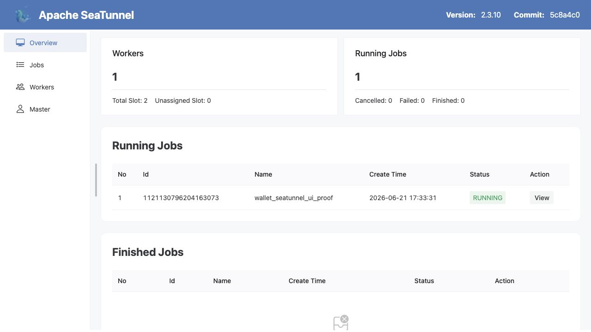

# Combination 3: SeaTunnel Config-Managed ETL

[Back to combination index](README.md) | [Main research report](../realtime-etl-research.md)

## Recommendation

Use **Apache SeaTunnel** when you want a config-first ETL platform for source-to-transform-to-sink pipelines. It is the best fit when the job is mostly movement, filtering, projection, simple enrichment, and connector configuration.

SeaTunnel should not be the first choice for Java/gRPC-heavy enrichment. For that, use Flink Java DataStream or Camel Spring Boot.

| Component | Role |
|---|---|
| SeaTunnel | ETL job platform and execution layer |
| SeaTunnel config | Source, transform, sink definition |
| Kafka/RocketMQ | Message queue source and sink |
| Git/CI | Preferred place to review and promote configs |

## Runtime UI Screenshot

This is a real SeaTunnel Engine UI page captured from `http://localhost:28087/#/overview` on 2026-06-22 with the SeaTunnel Engine HTTP UI enabled. It shows a submitted cluster job named `wallet_seatunnel_ui_proof` with status `RUNNING`.

Important scope note: this UI job uses `FakeSource -> SQL transform -> Console` so the SeaTunnel Engine dashboard truthfully shows a created/running job. The actual e-wallet queue source/transform/sink proof remains the Kafka/Redpanda SeaTunnel config and execution evidence listed below.



## UI Configuration Capability

SeaTunnel has two different web-facing pieces that should not be mixed up:

| SeaTunnel UI | Can configure/create jobs in browser? | Role |
|---|---:|---|
| SeaTunnel Engine UI | No, not as proven here | Monitor workers, master, running jobs, and finished jobs |
| SeaTunnel Web | Yes | Visual task creation/submission for SeaTunnel jobs |

So the accurate answer is: **SeaTunnel can support browser-based job configuration via the separate SeaTunnel Web project, but the local screenshot in this report is only SeaTunnel Engine UI, not SeaTunnel Web.**

For production evaluation, deploy SeaTunnel Web separately and validate whether its visual task model covers your source/transform/sink patterns, promotion workflow, permissions, and target connector versions.

## Source / Transform / Sink Architecture

```text
Kafka or RocketMQ source
        -> SeaTunnel job config
        -> SQL transform
        -> Kafka or RocketMQ sink
```

This is the cleanest path for simple ETL because the full pipeline is visible in one configuration file.

## Current Workspace Evidence

| Evidence | Status |
|---|---|
| SeaTunnel K8s source-transform-sink proof | Complete |
| Queue used in proof | Kafka-compatible Redpanda |
| Source topic | `phase2-seatunnel-wallet-events-v2` |
| Sink topic | `phase2-seatunnel-wallet-filtered-v2` |
| Transform | SeaTunnel SQL filter/enrichment |
| Proof files | [sink](../../local-setup/phase2-k8s-proofs/02-seatunnel-filtered.txt), [logs](../../local-setup/phase2-k8s-proofs/02-seatunnel-logs-running.txt) |
| Config | [seatunnel-kafka-wallet.conf](../../local-setup/seatunnel/seatunnel-kafka-wallet.conf) |
| K8s manifest | [seatunnel.yaml](../../local-setup/phase2-k8s/seatunnel.yaml) |

## Source Configuration

Current Kafka-compatible source:

```hocon
source {
  Kafka {
    bootstrap.servers = "phase2-redpanda:9092"
    topic = "phase2-seatunnel-wallet-events-v2"
    consumer.group = "phase2-seatunnel-wallet-poc-v2"
    start_mode = "earliest"
    format = "json"
    schema = {
      fields {
        event_id = "string"
        event_type = "string"
        wallet_id = "string"
        amount = "double"
        currency = "string"
      }
    }
  }
}
```

RocketMQ source shape:

```hocon
source {
  RocketMQ {
    topics = "wallet-events-rmq"
    name.srv.addr = "rocketmq-namesrv:9876"
    consumer.group = "wallet-seatunnel-etl"
    format = "json"
    schema = {
      fields {
        event_id = "string"
        event_type = "string"
        wallet_id = "string"
        amount = "double"
        currency = "string"
      }
    }
  }
}
```

SeaTunnel's RocketMQ source documentation lists `topics` and `name.srv.addr` as required source options and documents stream/exactly-once support for the connector.

## Transform Configuration

Current transform:

```hocon
transform {
  Sql {
    plugin_input = "Kafka"
    plugin_output = "wallet_filtered"
    query = "select event_id, event_type, wallet_id, amount, currency, case when amount >= 1000 then 'HIGH' else 'STANDARD' end as risk_tier, 'seatunnel-k8s-phase2' as pipeline from Kafka where event_type = 'wallet.payment.authorized' and amount >= 100"
  }
}
```

For RocketMQ, the transform is the same conceptually, but `plugin_input` should match the source plugin name used in the job.

## Sink Configuration

Current Kafka-compatible sink:

```hocon
sink {
  Kafka {
    source_table_name = "wallet_filtered"
    bootstrap.servers = "phase2-redpanda:9092"
    topic = "phase2-seatunnel-wallet-filtered-v2"
    format = "json"
  }
}
```

RocketMQ sink shape:

```hocon
sink {
  RocketMQ {
    source_table_name = "wallet_filtered"
    topic = "wallet-filtered-rmq"
    name.srv.addr = "rocketmq-namesrv:9876"
    producer.group = "wallet-seatunnel-producer"
  }
}
```

SeaTunnel's RocketMQ sink documentation lists `topic` and `name.srv.addr` as required options and states that the sink writes rows to a RocketMQ topic.

## Operational Model

| Operation | SeaTunnel Fit |
|---|---|
| New pipeline | Add a new config file |
| Review | Git review of HOCON config |
| CI validation | Run `seatunnel.sh --config <file> --check` |
| Job-level tests | Use `FakeSource -> transform -> Assert sink` for deterministic tests |
| Deployment | CLI, REST API, scheduler, or Kubernetes job |
| Runtime edits | Usually redeploy/restart config-managed job |

## gRPC Position

SeaTunnel is not ideal if the transform must call gRPC for every event. That is application logic, not simple ETL configuration.

Recommended split:

```text
Simple filter/map/move jobs -> SeaTunnel
Custom Java/gRPC jobs -> Flink Java or Camel
```

If SeaTunnel must call external services, validate the exact plugin/transform approach and isolate the service behind a simple HTTP/gRPC adapter with strict timeout and failure policy.

## Testing Plan

| Test | Required Evidence |
|---|---|
| Config validation | `seatunnel.sh --config wallet.conf --check` succeeds |
| Job-level assertion | `FakeSource -> SQL -> Assert` validates rows and fields |
| Kafka integration | Source and sink topics verified with real Kafka-compatible broker |
| RocketMQ integration | Same job with RocketMQ source and sink |
| Restart behavior | Kill job and verify offsets/checkpoint behavior |
| Bad messages | Malformed JSON handling is explicit |

## Main Risks

- Less flexible than Flink Java for complex stateful logic.
- gRPC/external lookup behavior is not the natural happy path.
- Connector semantics must be tested per broker.
- Runtime hot-edit expectations should be managed; treat configs as deployable artifacts.

## Final Verdict

Choose SeaTunnel as the **default config-first ETL path**. Use it for straightforward source/transform/sink pipelines. Do not use it as the primary tool for Java/gRPC-heavy wallet enrichment.

References:

- SeaTunnel RocketMQ source: https://seatunnel.apache.org/docs/2.3.10/connector-v2/source/RocketMQ/
- SeaTunnel RocketMQ sink: https://seatunnel.apache.org/docs/connectors/sink/RocketMQ/
- SeaTunnel command docs: https://seatunnel.apache.org/docs/seatunnel-engine/user-command/
- SeaTunnel Web deployment: https://seatunnel.apache.org/seatunnel_web/1.0.0/deploy/
