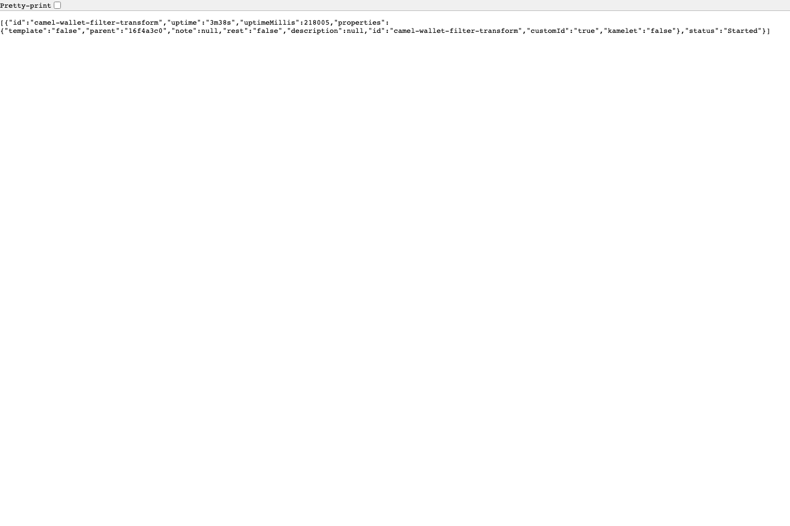

# Combination 4: Apache Camel Spring Boot

[Back to combination index](README.md) | [Main research report](../realtime-etl-research.md)

## Recommendation

Use **Apache Camel on Spring Boot** when the ETL should be owned like an application service and the transformation needs Java code, gRPC calls, internal service clients, retries, dead-letter handling, and standard Spring observability.

This is not as strong as Flink for stateful stream processing, but it is often the most practical path for service-team-owned integration logic.

| Component | Role |
|---|---|
| Spring Boot | Service runtime, configuration, lifecycle, observability |
| Apache Camel | Route DSL for source/transform/sink |
| Kafka/RocketMQ | Source and sink message queues |
| Java gRPC client | External enrichment client |

## Runtime Endpoint Screenshot

Camel Spring Boot does not provide a product ETL workbench UI or login dashboard in this setup. This screenshot is from the real running Spring Boot Actuator route endpoint on 2026-06-22, so it is runtime endpoint evidence, not a Web UI/dashboard screenshot.



## Source / Transform / Sink Architecture

```text
Kafka or RocketMQ source topic
        -> Camel route in Spring Boot
        -> unmarshal JSON
        -> Java predicate and processor
        -> gRPC enrichment call
        -> marshal JSON
        -> filtered topic
        -> dead-letter topic for rejected/errors
```

This is a good fit if your team wants each ETL pipeline to be built, tested, deployed, monitored, and owned like a normal service.

## Current Workspace Evidence

| Evidence | Status |
|---|---|
| Camel Spring Boot K8s source-transform-sink proof | Complete |
| Queue used in proof | Kafka-compatible Redpanda |
| Source topic | `phase2-camel-wallet-events` |
| Filtered sink | `phase2-camel-wallet-filtered` |
| Dead-letter sink | `phase2-camel-wallet-deadletter` |
| Proof files | [filtered](../../local-setup/phase2-k8s-proofs/05-camel-filtered.txt), [deadletter](../../local-setup/phase2-k8s-proofs/05-camel-deadletter.txt), [logs](../../local-setup/phase2-k8s-proofs/05-camel-logs.txt) |
| Local code | [WalletEventRoute.java](../../local-setup/camel-wallet-pipeline/src/main/java/com/example/walletetl/WalletEventRoute.java) |

## Source Configuration

Kafka source route shape:

```java
from("kafka:{{wallet.source-topic}}?brokers={{kafka.brokers}}")
    .routeId("camel-wallet-filter-transform")
```

Typical Spring configuration:

```properties
kafka.brokers=phase2-redpanda:9092
wallet.source-topic=wallet-events
wallet.filtered-topic=wallet-filtered
wallet.deadletter-topic=wallet-deadletter
```

RocketMQ source route shape:

```java
from("rocketmq:wallet-events-rmq"
    + "?namesrvAddr=rocketmq-namesrv:9876"
    + "&consumerGroup=wallet-camel-etl")
```

The Camel RocketMQ component uses URI format `rocketmq:topicName?[options]` and exposes `namesrvAddr` and `consumerGroup` endpoint options.

## Transform Configuration

Recommended Java route:

```java
from("kafka:{{wallet.source-topic}}?brokers={{kafka.brokers}}")
    .routeId("camel-wallet-filter-transform")
    .unmarshal().json(JsonLibrary.Jackson, WalletEvent.class)
    .choice()
        .when(exchange -> {
            WalletEvent event = exchange.getMessage().getBody(WalletEvent.class);
            return "wallet.payment.authorized".equals(event.eventType())
                && event.amount().compareTo(new BigDecimal("100")) >= 0;
        })
            .process(grpcRiskEnrichmentProcessor)
            .marshal().json(JsonLibrary.Jackson)
            .to("kafka:{{wallet.filtered-topic}}?brokers={{kafka.brokers}}")
        .otherwise()
            .marshal().json(JsonLibrary.Jackson)
            .to("kafka:{{wallet.deadletter-topic}}?brokers={{kafka.brokers}}");
```

gRPC processor responsibilities:

| Concern | Recommendation |
|---|---|
| Client | Generated Java gRPC stub managed by Spring |
| Timeout | Per-call deadline |
| Retry | Resilience4j/Spring Retry only for safe reads |
| Circuit breaker | Protect route when enrichment service is degraded |
| Bulkhead | Limit concurrent gRPC calls |
| Fallback | Dead-letter or `risk_tier=UNKNOWN`, based on product policy |

## Sink Configuration

Kafka sink route:

```java
.to("kafka:{{wallet.filtered-topic}}?brokers={{kafka.brokers}}")
```

RocketMQ sink route:

```java
.to("rocketmq:wallet-filtered-rmq?namesrvAddr=rocketmq-namesrv:9876")
```

Dead-letter sink:

```java
.to("rocketmq:wallet-deadletter-rmq?namesrvAddr=rocketmq-namesrv:9876")
```

## Operational Model

| Operation | Camel Spring Boot Fit |
|---|---|
| Build | Maven/Gradle application build |
| Deploy | Kubernetes Deployment |
| Config | Spring properties, ConfigMap, Secret |
| Observability | Actuator, Micrometer, logs, tracing |
| Runtime edits | Redeploy or controlled route reload pattern |
| Ownership | Application team |

## UI Configuration Capability

| Question | Answer |
|---|---|
| Does this combination have a UI? | No ETL workbench UI in this proof |
| What UI evidence exists? | Spring Boot Actuator route endpoint for runtime status |
| Can users configure/create ETL jobs in UI? | No |
| What can be configured without code? | Spring properties, ConfigMaps, Secrets, and route parameters if designed that way |
| What requires code/redeploy? | Route DSL, Java processors, gRPC client logic, retry/circuit-breaker behavior |
| Best configuration model | Application code in Git + Spring configuration + CI/CD deployment |

Camel is the right option when ETL ownership should follow normal Java/Spring service engineering, not browser-based pipeline authoring.

## When To Prefer Camel Over Flink

Choose Camel if:

- The pipeline is mostly stateless.
- The main complexity is integration with internal services.
- The owning team is a Spring Boot application team.
- gRPC calls are central to the transform.
- You want normal service testing and deployment patterns.

Choose Flink instead if:

- You need keyed state.
- You need event-time windows or joins.
- You need large-scale replay and checkpoint-heavy behavior.
- You need strong stream-processing semantics beyond route integration.

## Testing Plan

| Test | Required Evidence |
|---|---|
| Route unit test | Camel route test with sample wallet events |
| gRPC mock test | Mock risk service returns STANDARD/HIGH/timeout |
| Dead-letter test | Rejected/low-value/error events route to dead-letter |
| Idempotency test | Duplicate event_id does not trigger unsafe external effects |
| RocketMQ test | Same route with RocketMQ source and sink |
| Observability test | Actuator route status, metrics, and logs are available |

## Main Risks

- Weaker than Flink for stateful stream processing.
- Route sprawl if every pipeline becomes a separate service without standards.
- Runtime self-service is weaker than NiFi or Dinky.
- Exactly-once semantics are not the core strength; design idempotency explicitly.

## Final Verdict

Choose Camel Spring Boot for **service-owned Java/gRPC ETL routes**. It is the strongest non-Flink option for your gRPC requirement, especially if the wallet platform already operates Spring Boot services well.

References:

- Camel RocketMQ component: https://camel.apache.org/components/4.18.x/rocketmq-component.html
- Camel Kafka component: https://camel.apache.org/components/4.18.x/kafka-component.html
- Camel Spring Boot: https://camel.apache.org/camel-spring-boot/4.18.x/spring-boot.html
