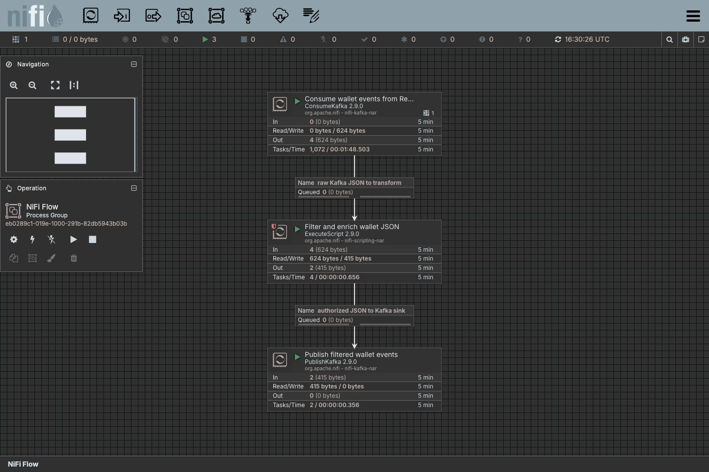

# Combination 5: Apache NiFi Visual Flow

[Back to combination index](README.md) | [Main research report](../realtime-etl-research.md)

## Recommendation

Use **Apache NiFi** when operations-managed visual flow control is the priority. It is strongest for UI-driven flow design, runtime visibility, queues, backpressure, provenance, parameterized deployments, and REST/API-managed flows.

For your e-wallet case, NiFi is a good candidate only if the team values visual operations more than deep stream-processing semantics. It is not the best fit for direct RocketMQ or Java/gRPC-heavy processing unless those integration gaps are deliberately solved.

| Component | Role |
|---|---|
| NiFi canvas/API | Visual flow definition and runtime control |
| ConsumeKafka / PublishKafka | Proven source and sink path |
| ExecuteScript / processors | JSON filter/enrichment |
| Custom processor or adapter | Needed for RocketMQ and gRPC if direct support is required |

## Live UI Screenshot

This is a real Apache NiFi canvas captured from `http://localhost:18090/nifi/` on 2026-06-22. The local NiFi proof is intentionally unsecured, so there is no login screen. The screenshot shows the configured flow processors for Kafka source ingestion, JSON filter/enrichment, and Kafka sink publishing.



## Source / Transform / Sink Architecture

```text
Kafka source topic
        -> NiFi ConsumeKafka
        -> ExecuteScript or record processors
        -> filter authorized payments
        -> enrich risk_tier
        -> PublishKafka filtered topic
        -> optional dead-letter flow
```

RocketMQ architecture options:

```text
Option A: RocketMQ -> adapter service -> Kafka/NiFi -> sink
Option B: Custom NiFi RocketMQ processor/NAR
Option C: HTTP/gRPC bridge around RocketMQ consume/publish
```

Option B is the cleanest architecturally but carries custom plugin maintenance cost.

## Current Workspace Evidence

| Evidence | Status |
|---|---|
| NiFi K8s source-transform-sink proof | Complete |
| Queue used in proof | Kafka-compatible Redpanda |
| Source topic | `phase2-nifi-wallet-events-<run-id>` |
| Sink topic | `phase2-nifi-wallet-filtered-<run-id>` |
| Transform | Groovy `ExecuteScript` JSON parse/filter/enrich |
| Proof files | [flow summary](../../local-setup/phase2-k8s-proofs/03-nifi-flow-status-summary.txt), [source](../../local-setup/phase2-k8s-proofs/03-nifi-source-topic.txt), [sink](../../local-setup/phase2-k8s-proofs/03-nifi-sink-topic.txt) |
| Flow definition | [03-nifi-flow-definition.json](../../local-setup/phase2-k8s-proofs/03-nifi-flow-definition.json) |

## Source Configuration

Current proven source is Kafka:

```text
Processor: ConsumeKafka
Topic: phase2-nifi-wallet-events-<run-id>
Bootstrap Servers: phase2-redpanda:9092
Group ID: phase2-nifi-wallet-poc
Value format: JSON payload
```

RocketMQ source choices:

| Choice | Fit |
|---|---|
| Custom NiFi processor | Best long-term if NiFi is selected |
| RocketMQ to Kafka bridge | Fastest workaround but adds another moving part |
| HTTP adapter | Useful if an internal service already exposes events |
| JMS bridge | Possible only if the RocketMQ/JMS path matches target requirements |

## Transform Configuration

Current proof transform shape:

```groovy
def event = new JsonSlurper().parseText(flowFileText)
if (event.event_type == "wallet.payment.authorized" && event.amount >= 100) {
  event.pipeline = "nifi-k8s-phase2"
  event.risk_tier = event.amount >= 1000 ? "HIGH" : "STANDARD"
  session.write(flowFile, { out ->
    out.write(JsonOutput.toJson(event).getBytes("UTF-8"))
  } as OutputStreamCallback)
  session.transfer(flowFile, REL_SUCCESS)
} else {
  session.remove(flowFile)
}
```

For production, prefer record processors or a compiled custom processor over long ad hoc scripts if performance, typing, and governance matter.

## Sink Configuration

Current proven sink:

```text
Processor: PublishKafka
Topic: phase2-nifi-wallet-filtered-<run-id>
Bootstrap Servers: phase2-redpanda:9092
Payload: enriched JSON
```

Production should add:

```text
PublishKafka filtered topic
PublishKafka dead-letter topic
Failure relationship to retry/dead-letter queue
Provenance retention policy
Backpressure thresholds
Parameter contexts per environment
```

## gRPC Position

NiFi can call external services, but direct gRPC is not as natural as Java code in Flink or Camel. Safer options:

| Option | Recommendation |
|---|---|
| InvokeHTTP to adapter | Preferred if gRPC can be wrapped by an internal HTTP service |
| Custom processor | Best if direct gRPC is mandatory and NiFi is strategic |
| ExecuteScript with gRPC library | Avoid unless carefully governed |
| Move enrichment to Flink/Camel | Preferred for complex gRPC logic |

## Operational Model

| Operation | NiFi Fit |
|---|---|
| Visual editing | Strong |
| Runtime flow control | Strong |
| Backpressure visibility | Strong |
| Provenance | Strong |
| Git-style config review | Needs Registry/export discipline |
| RocketMQ native support | Weak until validated or built |
| Heavy custom code | Weaker than Flink/Camel |

## UI Configuration Capability

| Question | Answer |
|---|---|
| Does this combination have a UI? | Yes, NiFi canvas |
| Can users configure/create jobs in UI? | Yes |
| What can be authored in UI? | Processors, connections, queues, parameter contexts, backpressure, start/stop behavior, provenance inspection |
| What still requires code/plugin work? | Custom RocketMQ processor, direct gRPC processor, compiled extension logic, heavily governed transforms |
| Best configuration model | Visual flow configuration + parameter contexts + versioned process groups + promotion governance |

NiFi is the strongest UI-first option among the five, but production governance is required to avoid uncontrolled live edits.

## Testing Plan

| Test | Required Evidence |
|---|---|
| Flow creation | REST-created or versioned process group can be applied repeatably |
| Filter correctness | Four inputs produce two filtered outputs |
| Backpressure | Queue thresholds behave under slow sink |
| Error route | Bad JSON and failed enrichment route to dead-letter |
| RocketMQ validation | Native/custom/bridge source and sink tested |
| Promotion | Dev flow promoted to staging/prod with parameters |

## Main Risks

- RocketMQ support is the largest gap.
- Scripts can become hard to maintain and tune.
- gRPC integration needs a disciplined adapter or custom processor.
- UI-driven changes require governance to avoid unreviewed production edits.

## Final Verdict

Choose NiFi only if **visual operations and provenance** are primary requirements. For your Java/gRPC-heavy path, Flink Java or Camel Spring Boot are better primary choices.

References:

- Apache NiFi: https://nifi.apache.org/
- NiFi administration guide: https://nifi.apache.org/docs.html
- NiFi REST API: https://nifi.apache.org/docs/nifi-docs/rest-api/
